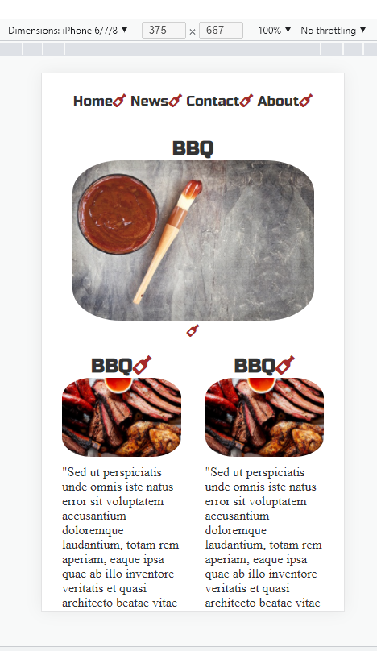

# bbq-sass

## ABOUT

Compiling CSS from SCSS via SaSS, installed via NPM.
Use "script": 'npm run sass' to watch for changes. 
This is an on-going project to teach myself SaSS.

### Screenshots

Phase 1 mobile view:

